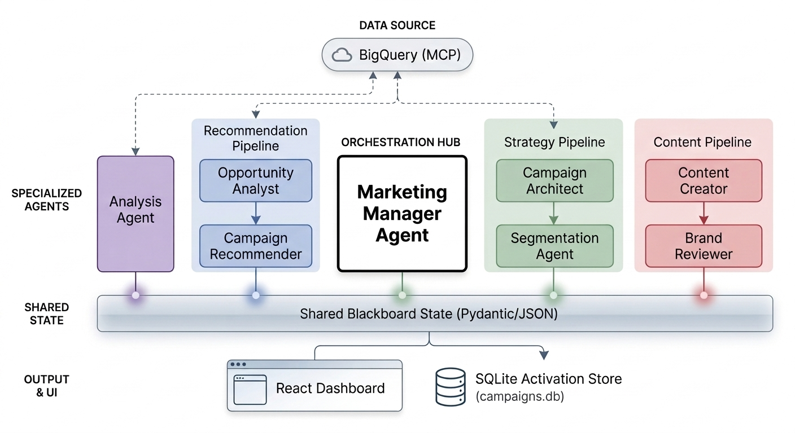

# CampaignFlow: Production ADK Marketing Dashboard

CampaignFlow is a professional, high-fidelity marketing orchestration platform built using the **Google ADK (Agent Development Kit)** and **React**. It enables a data-driven, multi-agent workflow to move from raw business data to activated marketing campaigns.

## 🏗 Architectural Overview

The application follows a **Hub-and-Spoke** orchestration model, layered with **Sequential Agent Pipelines** for specialized tasks.

### 1. The "Blackboard" State
All agents communicate through a shared session state called the "Blackboard." In the React frontend, this is managed via `BlackboardContext.tsx`.
*   **Data Keys**: `analysis_data`, `recommendations_data`, `brief_data`, `segments_data`, `content_data`, `review_data`.
*   **Smart Monitoring**: `App.tsx` contains a monitor that watches these keys and automatically switches the active dashboard view when new structured data is detected.

### 2. Backend Orchestration (`agents/marketing_agent/agent.py`)
The system uses three primary sequential pipelines called by a central **Marketing Manager**:

| Pipeline | Agents Included | Responsibility |
| :--- | :--- | :--- |
| **Recommendation** | Opportunity Analyst → Campaign Recommender | Finds data patterns (churn, low stock) and suggests 3 campaign ideas. |
| **Strategy** | Campaign Architect → Segmentation Agent | Defines the strategic brief and identifies/counts the target audience. |
| **Content** | Content Creator → Brand Reviewer | Generates personalized copy and validates it against brand guidelines. |

*   **Self-Healing**: The `BigQueryReflectRetryPlugin` is applied at the App level to automatically recover from SQL errors.
*   **Strict JSON**: All sub-agents are commanded to output **ONLY structured JSON** to ensure clean parsing by the UI and prevent conversational "leaks" into data cards.

## 🧪 Testing & Validation

CampaignFlow uses a multi-layered testing strategy to ensure reliability across the agent-frontend boundary.

### 1. Data Contract Validation
To prevent UI breaks due to agent "hallucinations" or schema changes, we use a custom validator:
*   **Script**: `scripts/validate_contract.py`
*   **Function**: Compares Python Pydantic models in `agent.py` with TypeScript interfaces in `BlackboardContext.ts`.
*   **Usage**: Run via `make validate-contract`.

### 2. Modular Behavioral Evaluations (ADK Eval)
The agent orchestration is validated against a 5-stage workflow defined in `tests/eval/evalsets/core_workflow.evalset.json`:
1.  **Analysis**: Direct data extraction capability.
2.  **Recommendation**: Generation of 3 distinct campaign ideas.
3.  **Strategy**: Formal briefing and audience segmentation.
4.  **Content**: Personalized drafting for multiple channels.
5.  **Review**: Brand compliance and feedback logic.

### 3. CI/CD Pipeline
The `ci.sh` script (run via `make test`) executes the following in order:
1.  **Contract Validation**: Ensures backend and frontend are in sync.
2.  **Linting**: Runs `ruff` (Agents) and `eslint` (App).
3.  **Unit Tests**: Runs `pytest` and `vitest`.
4.  **Behavioral Eval**: Executes the core marketing workflow evaluations.

## 🚀 The Activation Workflow

CampaignFlow implements a full production lifecycle via the **Activate** feature:

1.  **Selection**: The user opens the `ActivationModal` to select specific target segments and content drafts.
2.  **Evidence**: The modal displays the **Actual SQL Logic** used by the agents to identify segments, ensuring transparency.
3.  **Persistence**: Activated campaigns are stored in a local `campaigns.db` (SQLite).
4.  **API Access**: The backend (`frontend/app.py`) exposes `GET /api/activated-campaigns/{id}`, allowing downstream execution tools (Email/SMS gateways) to programmatically fetch the approved campaign material.

## 📊 UI/UX Standards

*   **Material Design 3**: Uses pill shapes, specific elevation levels, and a clean "Google-style" aesthetic.
*   **Data-to-Visual Mapping**: The `AnalysisPanel` is optimized for structured JSON. To prevent rendering empty objects, the `analysis_agent` uses strict Pydantic validation and instructions that mandate row-level data extraction.
*   **Unified Views**: Tasks that belong together are displayed together (e.g., Strategy + Audience, Content + Review).
*   **Ghost States**: Empty dashboard sections use "Ghost Cards" with centered icons and progress tracks to maintain layout balance before data is generated.
*   **Multi-JSON Parsing**: The `useChatStream` hook uses a robust regex parser to identify and extract multiple JSON blocks from a single concatenated agent stream.

## 🛠 Tech Stack

*   **Orchestration**: Python Google ADK
*   **Intelligence**: Gemini 2.0 Flash (Global Location)
*   **Data**: BigQuery (Customer, Sales, Products, Campaign History)
*   **Frontend**: React, TypeScript, Vite, Recharts, Lucide Icons
*   **Backend**: FastAPI (Proxy), SQLite (Activation DB)

## 📖 Future Interactions
When continuing work on this project:
*   **Backend**: Always ensure new sub-agents have `disallow_transfer_to_peers=True` and `disallow_transfer_to_parent=True`.
*   **Frontend**: If adding a new data key, update `BlackboardContext`, `useChatStream` (JSON parser), and the `Smart Monitor` in `App.tsx`.
*   **Visuals**: Maintain the 2x2 grid balance in `Dashboard.tsx` and the vertical-stack header style in `BlackboardCard.css`.
