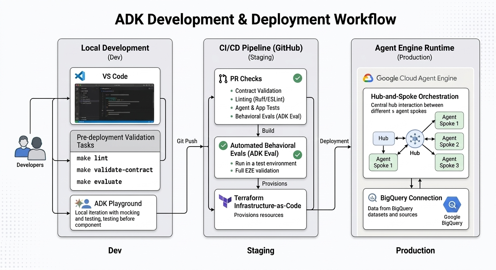

# Development & Deployment Lifecycle

This document visualizes the end-to-end flow from local development to production deployment, including the Hub-and-Spoke agent architecture and CI/CD pipelines.

## 1. Visual Development Flow



```text
[ LOCAL DEVELOPMENT ]          [ REMOTE SANDBOX ]          [ CI/CD PIPELINE ]          [ PRODUCTION ]
       (Dev)                        (Dev)                    (GitHub Actions)              (Prod)
         |                            |                            |                         |
  +------+------+              +------+------+              +------+------+           +------+------+
  |  Iterative  |              |   Manual    |              |  PR Checks   |           |   Stable    |
  |  Coding     |              | Deployment  |              | (Lint/Test)  |           |   Release   |
  +------+------+              +------+------+              +------+------+           +------+------+
         |                            |                            |                         |
         v                            v                            |                         |
  +------+------+              +------+------+                     |                         |
  | make test   |              | make deploy  |                    |                         |
  | make eval   |------------->|    -dev      |                    |                         |
  +------+------+              +------+------+                     |                         |
         |                            |                            |                         |
         +----------------------------+--------------------------->|                         |
                                      |                            v                         |
                               Push to 'dev' branch         +------+------+           +------+------+
                               Create Pull Request -------->|   Deploy to  |---------->|   Manual    |
                                                            |   Staging    |           |   Approval  |
                                                            +------+------+           +------+------+
                                                                   |                         |
                                                                   v                         |
                                                            +------+------+           +------+------+
                                                            |  Load Tests  |---------->|   Deploy to |
                                                            | (Locust)     |           |    Prod     |
                                                            +--------------+           +-------------+
```

## 2. Environment Details

### Phase 1: Local (High Velocity)
- **Tools**: `make playground` (ADK Web), `make ui` (Custom Chat).
- **Authentication**: Uses local Application Default Credentials (ADC).
- **Verification**: `make lint`, `make test`, `make eval`.

### Phase 2: Remote Dev (Sandbox)
- **Target**: Manual deployment to a dedicated "Dev" Agent Engine instance.
- **Identity**: Uses `marketing-agent-app-dev` service account.
- **Goal**: Verify cloud-specific logic (BigQuery MCP, IAM roles) before merging to main.
- **Command**: `make deploy-dev`.

### Phase 3: Staging (Automated)
- **Trigger**: Merge to `main` branch.
- **Workflow**: 
    1. Infrastructure update (Terraform).
    2. Deploy to Staging Agent Engine.
    3. Run integration tests.
    4. Run Locust load tests.
- **Identity**: Uses `marketing-agent-app-staging` service account.

### Phase 4: Production (Verified)
- **Trigger**: Manual approval of the Staging workflow.
- **Identity**: Uses `marketing-agent-app-prod` service account.
- **Architecture**: The **Hub-and-Spoke** model ensures that the `marketing_manager` coordinates all sub-agents identically across every environment.

## 3. Deployment Mapping

| Environment | Service Account | Branch | Trigger |
| :--- | :--- | :--- | :--- |
| **Local** | User ADC | `dev` | Manual |
| **Dev** | `app-dev@...` | `dev` | `make deploy-dev` |
| **Staging** | `app-staging@...` | `main` | Push to `main` |
| **Prod** | `app-prod@...` | `main` | Manual Approval |
